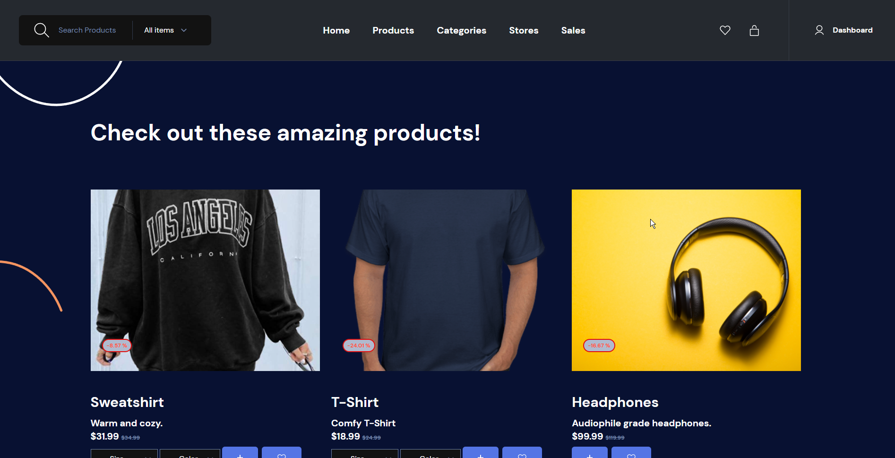

# Etsy Clone

### Landing Page:

# Purpose of the app:

Creates an online shopping marketplace for goods sold by small business owners. Based off of the popular marketplace [Etsy](https://www.etsy.com/).

# How to use:

The website is best used when signed into an account. Create an account on the login/register page or easily sign into EtsyClone with your Google account. 

From the navbar, you may search for products on the store or display them in predefined groups:

1. Products displays all products
2. Categories display products from a specific category
3. Stores shows all products from a specific store
4. Sales shows all products that are currently on sale

In the product container, click the plus sign under the product image to add it to your shopping cart or the heart to add it to your wishlist. Your wishlist can be viewed by clicking the heart logo in the top navbar. The shopping cart can be accessed by clicking on the shopping bag in the navbar.

While viewing your cart, click on Go To Checkout to pay and submit your order.

To create your own online store and products, navigate to your user dashboard. Either click on Dashboard in the navbar or if on mobile, pull up the navbar menu and select Dashboard.

From your dashboard you can add/edit your store, add/edit/delete your store's products, view reviews and your order history. You can also update your password, sign out, or deactivate your account if you wish to stop selling your products.

### Live Link:

<https://our-etsy.herokuapp.com/>

### Technology Stack:
HTML, CSS, Tailwind, Javascript, Node.js, Mustache, Express, Google Auth Library, Multer, Stripe API

### Database:

PostgreSQL using Sequelize ORM

### Built by:

[Jason Paff](https://github.com/JasonPaff), [Phil Slater](https://github.com/Phil-Slater), [Cristobal Martinez](https://github.com/Cristobalmtz16)
